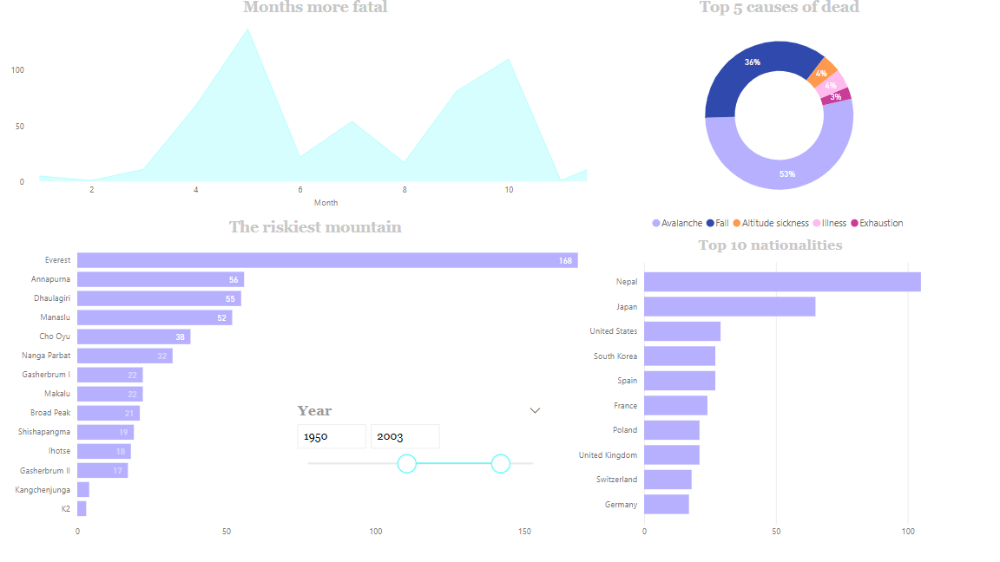
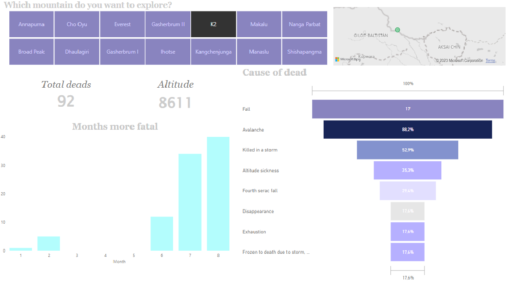

# The last climb

## Análisis exploratorio de datos (EDA)

## Índice

1. [🗺️ Descripción](#descripcion-del-proyecto)
2. [🏔️ Objetivo](#objetivo)
3. [🌀 Análisis](#analisis)
4. [🧗‍♀️ Conclusiones](#conclusion)
5. [🧊 Estructura](#estructura)


## 🗺️ Descripción:<a name="descripción"/>

Proyecto EDA como Data Analyst en Ironhack. 

Con este proyecto se propone la práctica de análisis tipo EDA. Para ello, hemos escogido analizar las muertes registradas desde el 1895 en los 14 ochomil, las 14 montañas más altas de la Tierra donde cada año intrépidos aventureros y aventureras las intentan conquistar.

## 🏔️ Objetivo:<a name="objetivo"/>

El riesgo de conquistar alguna de las 14 ochomil es muy alto, las condiciones meteorológicas, las complicaciones o la aclimatación a la altitud son motivos cruciales a la hora de superarlo o no. Lamentablemente, cada año se quedan en el camino para siempre muchos de sus montañistas. De ellas, es el Everest el que más motañistas atrae al año llegando a las 800 visitas pero tenemos más dudas al respecto que nos disponemos a analizar para intentar esocger cuándo, cómo y en dónde es más seguro el ascenso:

- ¿En qué zona se encuentran las cumbres?
- ¿Cuál es la montaña con más riesgo de fallecimiento?
- ¿Según qué época es mas letal subirlas? ¿Y cada una de ellas?
- ¿Hay alguna nacionalidad que se pone más en riesgo al intentar llegar a la cumbre?
- ¿Cuáles son las causas de muerte más comunes?
- ¿Puede haber alguna relación entre la causa de muerte y la nacionalidad?


## 🌀 Análisis:<a name="analisis"/>

En primer lugar, hemos decido crear un mapa para situar cada una de las cumbres de forma directa.


En el siguiente dashboard podemos observar un resumen del conjunto total de los datos. Contiene un slider con el que se puede seleccionar el rango de años del cual queremos obtener la información. Según ello, se puede saber cuáles fueron los meses con más fallecimientos, las cinco causas de muerte más habituales, en qué montaña ha fallecido más gente y de qué diez nacionalidades eran esas personas.

La imagen muestra esos resultados filtrados desde el 1980 al 2003.




El segundo dashboard lo hemos enfocado al análisis de cada una de las cumbres por separado. Para ello hemos creado un selector interactivo mediante el cual se puede elegir la montaña deseada. De ella obtendremos la información de su altitiud, su localización en el mapa, cuántos fallecidos hay en total, en qué meses han ocurrido los desastres y cuáles han sido las siete causas más comunes.

En esta imagen podemos ver toda esta selección de la montaña K2, conocida por ser la más peligrosa.




## 🧗‍♀️ Conclusiones:<a name='conclusion'/>

Como vemos en el mapa, las 14 se concentran en las cordilleras del Himalaya y el Karakórum. 

Con el primer dashboard hemos podido observar que los meses de primavera y otoño son los que más fallecimientos registran, esto se ve directamente relacionado con la programación de las expediciones que se concentran en esos meses. 

Las avalanchas denotan ser la causa principal de muerte seguido por caídas y el llamado mal de alturas.

Sobre las muertes registradas, vemos que el Everest es el que más tiene con diferencia. Esto es debido a que es la montaña más visitada llegando a registrar hasta 800 expediciones anuales. Pero comparando las muertes con las subidas obtenemos que las más peligrosas en si son Annapurna, K2 y Nanga Parbat.

Nepal aparece como país con más registros de nacionalidades fallecidas. Es un valor adecuado ya que se cuentan en este registro tanto los fallecimientos de escaladores como de sherpas, siendo estos últimos de mayoría procedente de la misma zona. Le continuan Japón, Corea del sur y España, países con mucha tradición de montaña y escalada.

Gracias al segundo dashbord se pueden analizar más en profundidad cada una de las cumbres. De ella podemos destacar cómo las que se encuentran hacia el noroeste coinciden con el mes más mortal julio. 


## 🧊 Estructura:<a name="estructura"/>

```
Proyecto 
|__ DATA/                         # contiene datos limpios de jupyter notebook y los csv limpios
|
|__ IMAGES/                       # contiene imagénes referentes al proyecto y de los dashboards   
|
|
|__ .gitignore                    # archivo gitignore     
|
|__ README.md                     # información del proyecto
```